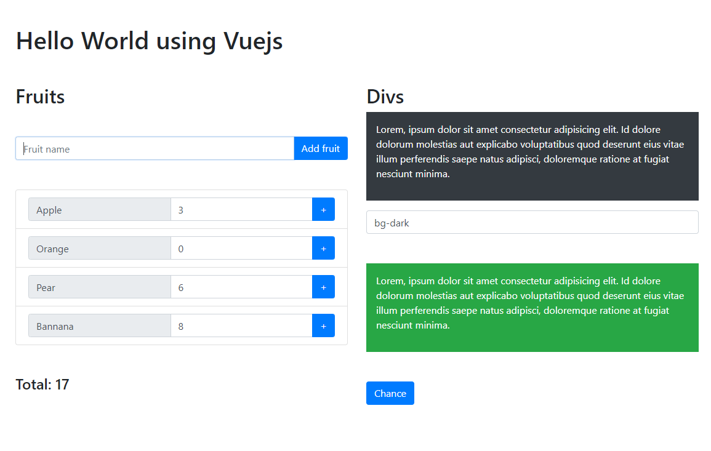

# vuejs-boilerplate

## Description

Vue.js boilerplate, developed in 2020.

## Index

- [Instalation](#instalation)
- [Usage](#usage)
- [Live Preview](#live-preview)
- [License](#license)

## Instalation

## Usage

## Live Preview

[Live Preview](https://66eb0a607ae6545fe1cde754--soft-donut-7af87b.netlify.app/)

## License

GNU GENERAL PUBLIC LICENSE. Version 3, 29 June 2007. Copyright (C) 2007 Free Software Foundation, Inc. <https://fsf.org/> Everyone is permitted to copy and distribute verbatim copies of this license document, but changing it is not allowed.